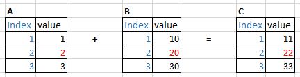

# CelloPype: reactive DataFrames, built from executable cells

## Introduction

The CelloPype Cell class allows you to build a pipeline of **interconnected DataFrames**, each with its own 'construction rules', where an update to any dataframe automatically cascades through the rest of the pipeline.

In abstract terms, a cell is a **function** that takes a number of other cells as inputs ('sources'), and calculates its own value as a result. Any change in value for a given cell must cascade through to any other cells depending on it. The resulting network must be one-directional, without any loops (i.e., a DAG).

**Implementation:** the Cell class wraps the actual DataFrame (or other variable) in its 'value' property. Dependencies and dynamic recalculation are handled by the Cell. Lazy computation is default, but subscription-type 'push on change' is supported.

## Example



```python
import pandas as pd
from cellopype import Cell
```

```python
# example from https://stackoverflow.com/questions/62671185
dfA = pd.DataFrame([1, 2, 3], columns=["value"])
dfB = pd.DataFrame([10, 20, 30], columns=["value"])

cell_a = Cell(recalc=lambda: dfA)
cell_b = Cell(recalc=lambda: dfB)
```

This is a bit contrived; cell_a and cell_b are 'recalculated' by loading an external dataframe. We might as well assign the dataframe directly to cell_a.value. But by having a recalc function, no matter how trivial, we can demonstrate lazy evaluation.

```python
# cell_c is defined by its recalc_fn as the sum of a and b
#
def recalc_fn(a, b):
    return pd.DataFrame(a + b)
cell_c = Cell(recalc=recalc_fn, sources=[cell_a, cell_b])
```

```python
# check: cell_a and cell_c are initialized: '_dirty', no value yet
print('cell_a:', cell_a._dirty, cell_a._value)
cell_a: True None
#
print('cell_c:', cell_c._dirty, cell_c._value)
cell_c: True None
```

```python
# reading c.value triggers recalc c -> triggers recalc a & b
#
print(cell_c.value)

    value
0   11
1   22
2   33
```

```python
# Change source value in dfA and invalidate cell_a
#
dfA.loc[0, "value"] = 222
cell_a.invalidate()  # or: cell_a.recalc() or: cell_a.value=dfA
#
# cell_a is now dirty, without value...
```

```python
# Getting cell_c.value triggers recalc across the pipeline:
#
print(cell_c.value)

    value
0   232
1   22
2   33
```

## API summary & example

```python
from cellopype import Cell
```

Every cell will have a **recalc** function that defines how changed source.values lead to a new cell value:

```python
def recalc_fn( a, b ):
   """Source.values are passed in, returns the new value for this cell"""
   # typically, a and b will be dataframes
   # the values of all specified sources are passed as args
   # args are positional, names do not have to match source names
   return a.add(b)
```

Optionally, define a handler that's called whenever the cell's **value** property changes (comparable to 'subscribe' in RX):

```python
def plot_it( df ):
   """Called with the cell.value whenever value changes; no return value"""
   # eg, plot this df (see plot-pipeline.py example)
   pass
```

**Constructor**, with cell_a and cell_b as sources:

```python
my_cell = Cell(
   sources[cell_a, cell_b], # specify the source cells for this cell's recalc
   recalc = recalc_fn,      # calculate new cell.value (source.values as args) (*)
   on_change = plot_it,     # called whenever cell 'value' changes
   lazy = True              # default=True: recalculate only when necessary (**)
)
```

(\*) Given our trivial recalc function, we could have simply passed in `recalc=pd.DataFrame.add`. When invoking a method, the first argument is taken as _self_.

(\*\*) If lazy=True: the cell's value property is recalculated when: \
&ensp;&ensp;(1) cell.recalc() is called or \
&ensp;&ensp;(2) cell.value is read (by your code or by another cell)\
If lazy=False, the cell is recalculated immediately when invalidated.

_NOTE: if you supply an on_change handler, this will imply lazy=False. We can only tell you a value's been changed if we're allowed to recalculate it immediately._

The cell's **value** property (as returned by the recalc function) is typically a DataFrame, but can be Series, scalar, etc. [Not all variable types have been tested, though.]

The **value getter** triggers recalc when necessary:

```python
print(my_cell.value)

    value
0   11
1   22
2   33
```

Finally, instance **methods** and **value setter**:

```python
my_cell.recalc()        # explicit force recalc
my_cell.invalidate()    # discard cached value (if lazy) or recalculate
my_cell.value = my_df   # set .value property through setter
```

For a given cell, its dependent cells will be invalidated:\
\- when cell.invalidate() is called, and the cell is configured for 'lazy' evaluation;\
\- when the cell.value changes (=after comparison with previous value, see helpers.deep_eq).
